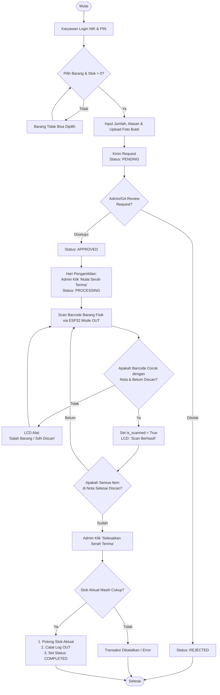
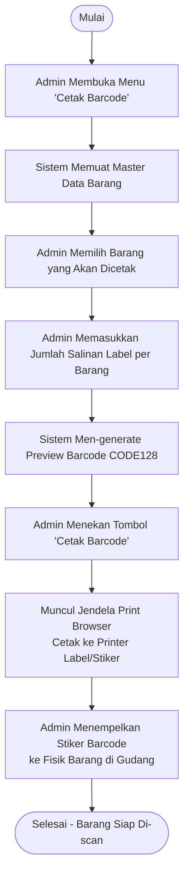

# Dokumentasi Alur Sistem Warehouse Management System (WMS)
*Dokumen Panduan Alur dan Flowchart untuk Manajer General Affairs (GA)*

---

Sistem WMS (Warehouse Management System) ini dirancang untuk mendigitalisasi dan mengotomatisasi pencatatan stok barang secara *real-time* di gudang. Sistem ini mengintegrasikan tiga komponen utama:
1. **Frontend Dashboard (Vue.js)**: Digunakan oleh Karyawan (untuk mengajukan permintaan barang) dan Admin/GA (untuk mengelola stok, menyetujui permintaan, dan memverifikasi antrean barang masuk).
2. **Backend Server (Node.js & PostgreSQL)**: Berfungsi sebagai otak sistem yang mengatur database, mengelola sesi keamanan, mencatat log aktivitas (*inventory logs*), serta menyimpan foto bukti ke cloud storage (Supabase).
3. **Hardware Barcode Scanner (ESP32)**: Alat pemindai fisik yang terhubung langsung ke server untuk memvalidasi barang secara cepat saat serah terima barang keluar maupun restock barang masuk.

Berikut adalah penjelasan detail alur sistem beserta **Flowchart** yang siap digunakan untuk presentasi atau diserahkan kepada Manajer GA.

---

## 1. Alur Pengeluaran Barang (MODE OUT - Serah Terima Barang Karyawan)

Alur ini mengatur bagaimana karyawan meminta barang (misal alat tulis kantor, kabel, helm, APD, dll.) hingga fisik barang diserahterimakan menggunakan bantuan *barcode scanner* untuk memastikan barang yang keluar sesuai dengan yang disetujui.

### Penjelasan Alur Kerja:
1. **Pengajuan Request (Karyawan)**:
   - Karyawan login ke sistem menggunakan **NIK** dan **PIN** mereka.
   - Karyawan memilih barang yang dibutuhkan dari katalog. Jika stok aktual barang tersebut adalah `0`, barang tidak dapat dipilih.
   - Karyawan mengisi jumlah barang yang diminta, alasan pengambilan, tanggal rencana pengambilan, serta mengunggah foto bukti pendukung (misalnya foto barang lama yang rusak atau hilang). Foto ini otomatis diunggah ke cloud storage Supabase.
   - Data request dikirim dan tersimpan dengan status awal **`pending`**.
2. **Persetujuan / Approval (Admin/GA)**:
   - Admin/GA memeriksa daftar permintaan masuk di dashboard.
   - Admin/GA meninjau alasan, tanggal pengambilan, dan foto bukti.
   - Admin menyetujui request (status berubah menjadi **`approved`**) atau menolaknya (**`rejected`**).
3. **Pembukaan Sesi Serah Terima (Admin/GA)**:
   - Pada hari pengambilan, karyawan mendatangi GA untuk serah terima barang fisik.
   - Admin mencari nota request karyawan tersebut di dashboard dan mengklik **"Mulai Serah Terima"**.
   - Status request berubah menjadi **`processing`** (gerbang scanner terbuka).
   - > [!IMPORTANT]
     > **Aturan Gatekeeper Keamanan:** Sistem hanya mengizinkan maksimal **1 nota request** berstatus `processing` dalam satu waktu. Hal ini untuk mencegah tabrakan scan (*race condition*) jika ada beberapa antrean serah terima sekaligus.
4. **Pemindaian Fisik Barang (Scanner ESP32 - MODE OUT)**:
   - Petugas gudang memposisikan alat scanner ESP32 pada **Mode OUT**.
   - Petugas melakukan scan barcode pada setiap fisik barang yang akan diserahkan.
   - Setiap ketukan scan mengirimkan kode barcode ke server. Server mencocokkan barcode tersebut dengan daftar barang di nota request yang sedang `processing` dan belum berstatus discan (`is_scanned = false`).
     - **Jika Cocok**: Status item tersebut diubah menjadi `is_scanned = true`. Layar LCD alat menampilkan pesan: `"Scan Berhasil! [Nama Barang]"`.
     - **Jika Salah/Sudah Discan**: Layar LCD alat menampilkan pesan: `"Salah Barang! Atau Sdh Discan"`.
5. **Penyelesaian & Potong Stok (Admin/GA)**:
   - Setelah semua barang dalam nota selesai di-scan secara fisik, Admin di dashboard mengklik **"Selesaikan Serah Terima"**.
   - Sistem melakukan verifikasi akhir untuk memastikan tidak ada barang yang terlewat (`is_scanned` harus `true` untuk semua item di detail nota) dan stok di gudang masih mencukupi.
   - Jika valid, sistem akan:
     - Mengubah status request menjadi **`completed`**.
     - Memotong stok aktual barang di database secara otomatis (`stok_aktual = stok_aktual - qty`).
     - Mencatat riwayat pengeluaran di tabel **`inventory_logs`** dengan tipe **`OUT`** lengkap dengan identitas admin PIC.

### Flowchart Serah Terima Barang Keluar (MODE OUT)



---

## 2. Alur Penerimaan Barang (MODE IN - Restock Gudang / Barang Masuk)

Alur ini digunakan saat barang baru datang dari vendor/supplier, atau ketika GA melakukan pengisian kembali (*restocking*) barang-barang gudang. Proses ini memanfaatkan scanner untuk mencatat antrean masuk secara fisik terlebih dahulu sebelum disetujui secara administratif oleh Admin.

### Penjelasan Alur Kerja:
1. **Pemindaian Barang Masuk (Petugas Gudang - MODE IN)**:
   - Petugas mengalihkan scanner ESP32 ke **Mode IN**.
   - Setiap barang masuk di-scan barcode-nya satu per satu.
   - Data scan dikirim ke server dan dimasukkan ke dalam tabel antrean **`scanner_queue`** dengan status **`PENDING`**.
     - **Jika Barang Belum Terdaftar di Master Data**: Layar LCD alat menampilkan: `"Barang Baru IN! Antre Didaftar"`.
     - **Jika Barang Sudah Terdaftar di Master Data**: Layar LCD alat menampilkan: `"Antrean MASUK: [Nama Barang]"`.
2. **Pemeriksaan Antrean & Input Kuantitas (Admin/GA)**:
   - Admin membuka dashboard menu **"Antrean Barang Masuk" (Restock Queue)** di frontend.
   - Sistem memiliki mekanisme pemblokiran duplikasi (anti-spam): **setiap barcode yang di-scan hanya akan masuk 1 kali** ke dalam daftar antrean `PENDING`.
   - Hal ini dilakukan untuk menghindari penumpukan data di database. Admin kemudian bertugas memverifikasi fisik kardus/barang yang datang dan **memasukkan kuantitas (jumlah) secara manual** ke dalam sistem.
3. **Eksekusi & Update Stok (Admin/GA)**:
   - Admin memverifikasi daftar barang masuk tersebut di layar dashboard.
   - Admin dapat melakukan tindakan:
     - **Menolak (Reject)**: Jika ada kesalahan scan, Admin mengklik tombol hapus antrean. Status antrean diubah menjadi **`REJECTED`** dan dibersihkan dari antrean.
     - **Menyetujui (Approve)**: Admin memasukkan jumlah kuantitas akhir barang yang disetujui berdasarkan hasil penghitungan fisik manual, lalu mengklik "Approve".
   - Setelah disetujui, sistem akan:
     - Menambah stok aktual barang di master database (`stok_aktual = stok_aktual + qty_approved`).
     - Mengubah status barcode pada tabel `scanner_queue` dari `PENDING` menjadi **`APPROVED`**.
     - Mencatat riwayat penambahan stok di tabel **`inventory_logs`** dengan tipe **`IN`** beserta identitas admin PIC.

### Flowchart Restock Barang Masuk (MODE IN)

```mermaid
flowchart TD
    Start([Mulai]) --> ScanPhysical[Petugas Scan Barcode Fisik Barang via ESP32 Mode IN]
    ScanPhysical --> CheckDB{Apakah Barcode\nTerdaftar di Master Items?}
    
    CheckDB -- Belum --> EnqueueNew[Masukkan ke scanner_queue PENDING\nLCD: 'Barang Baru IN! Antre Didaftar'] --> CheckQueue
    CheckDB -- Sudah --> EnqueueExist[Masukkan ke scanner_queue PENDING\nLCD: 'Antrean MASUK: [Nama Barang]'] --> CheckQueue
    
    CheckQueue[Admin Membuka Dashboard\nAntrean Barang Masuk - Restock Queue\n*1 Barcode = 1 Antrean, Qty diinput manual*] --> AdminAction{Tindakan Admin/GA?}
    
    AdminAction -- Hapus / Tolak --> RejectAction[Set Status Antrean: REJECTED\nHapus dari Daftar Antrean] --> End([Selesai])
    
    AdminAction -- Setujui / Approve --> InputQty[Verifikasi & Konfirmasi Qty Masuk]
    InputQty --> SaveStock[1. Tambah Stok Aktual di Master Items\n2. Catat Log IN di inventory_logs\n3. Set Status Antrean: APPROVED]
    SaveStock --> End
```

---

## 3. Fitur Pendukung & Aturan Bisnis Gudang (GA Master Rules)

Untuk memudahkan Manajer GA dalam melakukan pengawasan, sistem ini juga dilengkapi dengan parameter manajemen persediaan (*Inventory Control*) yang melekat pada setiap barang:

* **Stok Aktual (*Current Stock*)**: Jumlah fisik barang yang saat ini tersedia dan siap digunakan di gudang.
* **Harga per Unit**: Informasi nilai aset per satuan barang untuk mempermudah perhitungan nilai inventaris gudang GA.
* **Safety Stock & Limits (Manajemen Risiko)**:
  Setiap barang memiliki field batas kendali stok berikut untuk membantu pengadaan barang:
  - **Stok Minimum (Minimum Stock)**: Batas kritis stok barang. Jika stok aktual menyentuh atau berada di bawah nilai ini, sistem akan memberikan peringatan bahwa barang harus segera dipesan ulang (*Reorder Point*).
  - **Safety Stock**: Stok pengaman untuk mengantisipasi keterlambatan pengiriman dari vendor atau lonjakan permintaan yang mendadak.
  - **Stok Maksimum (Maximum Stock)**: Batas atas kapasitas penyimpanan efisien di gudang agar tidak terjadi penumpukan barang berlebih (*overstock*) yang memakan ruang dan anggaran belanja GA.
  - **Rata-rata Kebutuhan Bulanan**: Rata-rata konsumsi unit barang per bulan untuk membantu GA memproyeksikan kebutuhan belanja di bulan berikutnya.
* **Audit Trail (Inventory Logs)**: Setiap pergerakan barang (IN maupun OUT) dicatat lengkap dengan timestamp yang presisi, jumlah barang, referensi nomor nota request, dan PIC (karyawan/admin) yang bertanggung jawab untuk keperluan transparansi audit gudang.

---

## 4. Alur Pembuatan & Pencetakan Barcode Fisik (Labeling)

Sebelum barang dapat dipindai oleh alat scanner ESP32, setiap barang fisik harus memiliki label barcode yang tertempel. Admin/GA bertanggung jawab untuk mencetak label ini melalui sistem.

### Penjelasan Alur Kerja:
1. **Buka Menu Cetak Barcode (Admin/GA)**:
   - Admin membuka dashboard dan masuk ke menu **"Cetak Barcode"**.
   - Sistem akan memuat daftar seluruh barang yang terdaftar di Master Data (Items).
2. **Pilih Barang & Tentukan Jumlah**:
   - Admin memilih barang mana saja yang akan dicetak barcodenya.
   - Admin menentukan jumlah salinan (label) untuk masing-masing barang sesuai dengan kuantitas fisik yang ada di gudang.
3. **Preview & Cetak**:
   - Sistem secara otomatis men-generate gambar barcode (menggunakan format *CODE128*) beserta informasi nama barang dan kategori untuk di-*preview* pada layar.
   - Admin menekan tombol **"Cetak Barcode"**, yang akan memunculkan jendela *print browser*.
4. **Penempelan Fisik**:
   - Label barcode diprint pada kertas stiker/label (ukuran A4 dengan *grid* atau printer label khusus).
   - Admin menempelkan label fisik tersebut ke barang/kardus di gudang agar siap di-scan pada **MODE IN** (Restock) maupun **MODE OUT** (Serah Terima).

### Flowchart Cetak Barcode Fisik


