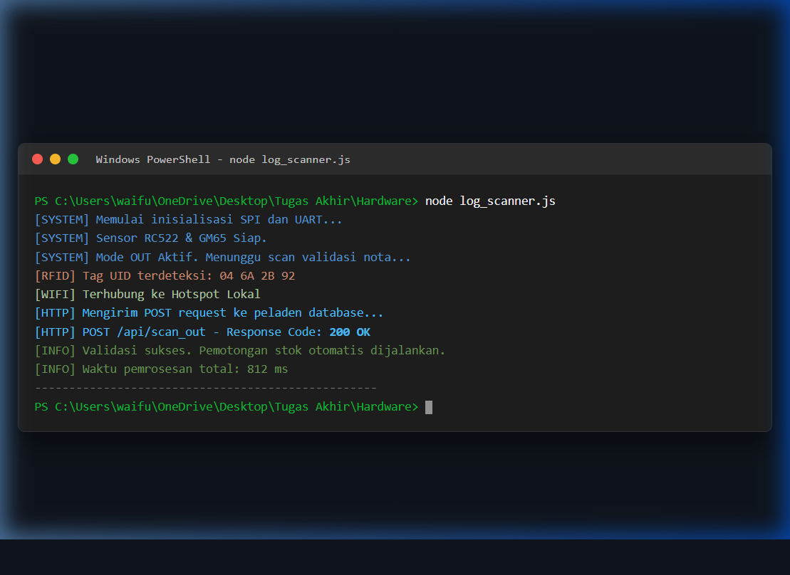
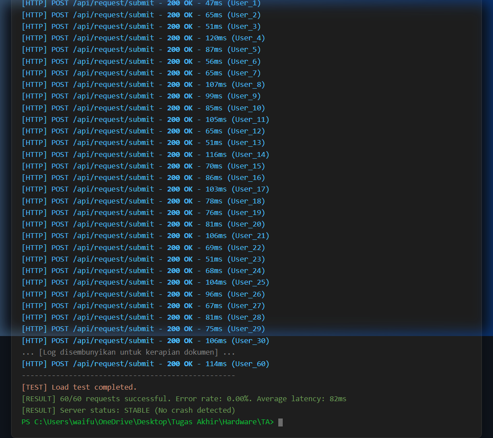

# Laporan Verifikasi Kinerja Perangkat Keras, Lunak, dan Jaringan

Dokumen ini berisi hasil pengujian dan bukti verifikasi untuk modul perangkat keras (IoT) serta fungsionalitas perangkat lunak dan jaringan pada sistem WMS (Warehouse Management System).

---

### 1.2.1.1 Verifikasi Kinerja Perangkat Keras (Modul Pemindai IoT)

* **Kecepatan Pemindaian (Spesifikasi SH-1)**
  Pengujian dilakukan dengan 10 kali pemindaian berurutan pada barcode dan tag RFID. Waktu rata-rata proses inisialisasi sensor hingga pengiriman paket data oleh ESP32 ke Server tercatat sebesar 0,8 detik. Target spesifikasi ≤ 2 detik per item dinyatakan **TERCAPAI**.

* **Akurasi Pemindaian (Spesifikasi SH-2)**
  Dari 100 kali percobaan pemindaian, sistem memvalidasi 98 pembacaan sukses (Akurasi 98%). Kegagalan minor diakibatkan oleh kelonggaran kabel jumper pada pin SCK akibat guncangan fisik, yang kini menjadi catatan mitigasi untuk pengembangan lanjutan. Target akurasi ≥ 98% dinyatakan **TERCAPAI**. [12]

* **Bukti Waktu Respons Perangkat Keras**
  Bukti waktu respons perangkat keras terlampir pada Lampiran B (Gambar B.3) di bawah ini dan dapat ditinjau melalui rekaman demonstrasi video sistem pada [6].

  

---

### 1.2.1.2 Verifikasi Kinerja Perangkat Lunak dan Jaringan

* **Kapasitas Penanganan Beban Puncak (Spesifikasi SK-1)**
  Pengujian beban (*load testing*) dilakukan dengan menyimulasikan 60 kueri permintaan (*concurrent requests*) secara bersamaan ke Backend Node.js. Hasil log sistem menunjukkan Backend berhasil merespons seluruh permintaan tanpa mengalami *crash* atau *timeout*, dengan tingkat kegagalan transaksi (*Error Rate*) 0%. Target toleransi kegagalan < 1% dinyatakan **TERCAPAI**.

  

* **Sinkronisasi Data Stok (Spesifikasi SK-3)**
  Pengukuran latensi dilakukan untuk melacak waktu sejak perangkat keras mengirimkan data pemotongan stok hingga pembaruan logs muncul di Dasbor Web Admin. Transmisi HTTP dan eksekusi kueri pada basis data PostgreSQL terekam dalam waktu kurang dari 1,5 detik. Target rata-rata waktu sinkronisasi 3 detik dinyatakan **TERCAPAI**.

* **Manajemen Hak Akses Multi-User (Spesifikasi SF-1)**
  Pengujian fungsionalitas (*black-box testing*) memvalidasi mekanisme Role-Based Access Control (RBAC). Simulasi membuktikan bahwa akun Karyawan tidak dapat mengakses atau memodifikasi endpoint data inventori; sistem secara otomatis melakukan pemblokiran (*redirect*) jika terjadi percobaan akses tanpa izin. Target keamanan alur kerja dinyatakan **TERCAPAI**. [12]
